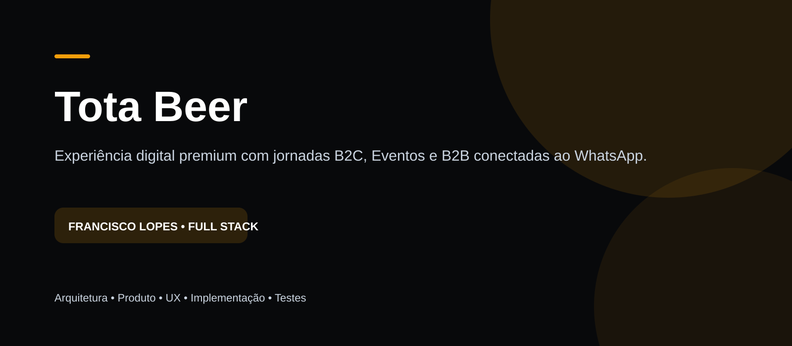

  

<h1 align="center">Tota Beer</h1>

  Experiência digital premium com jornadas B2C, Eventos e B2B conectadas ao WhatsApp.

  
  
  
  
  

> **Status:** Projeto comercial desenvolvido para apresentação — sem exposição de código proprietário.

## Visão geral

Criar uma experiência digital que valorizasse a marca e os quatro rótulos confirmados — Tradicional, NE IPA, Stout e Weiss — e organizasse três intenções comerciais diferentes sem transformar o site em um catálogo genérico.

Este repositório é uma **vitrine técnica/documental**. O objetivo é demonstrar decisões de arquitetura, produto, UX e engenharia sem publicar código proprietário, credenciais, dados reais ou configurações internas.

<table>
<tr>
<td align="center"><strong>3</strong> jornadas comerciais</td>
<td align="center"><strong>4</strong> rótulos confirmados</td>
<td align="center"><strong>5</strong> etapas no EventQuoter</td>
<td align="center"><strong>Mobile</strong> fluxo refinado</td>
</tr>
</table>

## Minha atuação

Atuação em **arquitetura, desenvolvimento full stack, integração, UX, validação, testes e refinamento da experiência**.

## Stack

Next.js • React • TypeScript • Tailwind CSS • GSAP • ScrollTrigger • Lenis • Framer Motion

## Principais funcionalidades

- Intro cinematográfica da fábrica em frame sequence
- Hero com produto protagonista
- BeerShowcase para os 4 rótulos confirmados
- Jornada B2C de descoberta
- EventQuoter com briefing estruturado
- Captação B2B
- WhatsApp contextual por intenção
- Persistência de UTM e analytics
- Tratamento específico para mobile e reduced motion

## Arquitetura

  

> O diagrama é propositalmente de alto nível para não expor detalhes sensíveis da implementação.

## Decisões técnicas

### WhatsApp como fechamento
A experiência organiza intenção e contexto antes da conversa, sem tentar substituir o atendimento humano.

### Frame sequence controlada
A entrada da fábrica usa sequência de frames para dar controle preciso de ritmo e transição.

### Motion com propósito
GSAP e ScrollTrigger reforçam narrativa e produto; prefers-reduced-motion mantém acessibilidade.

### Rigor factual
A estrutura aceita dados oficiais dos rótulos sem preencher atributos sensoriais ou comerciais não confirmados.

## Screenshots

<strong>Ver mais telas da experiência</strong>
 

## Privacidade e confidencialidade

Este repositório **não contém**:

- código-fonte de produção;
- arquivos `.env`;
- chaves, tokens ou credenciais;
- banco de dados real;
- dados pessoais;
- configurações internas;
- segredos comerciais.

As imagens utilizadas aqui servem somente para apresentar o trabalho realizado e não devem ser reutilizadas como material oficial das empresas sem autorização.

## Autor

**Francisco Lopes de Sousa Filho**  
Desenvolvedor Full Stack

[GitHub](https://github.com/franciscolopesdev) • contactdevlps@gmail.com
